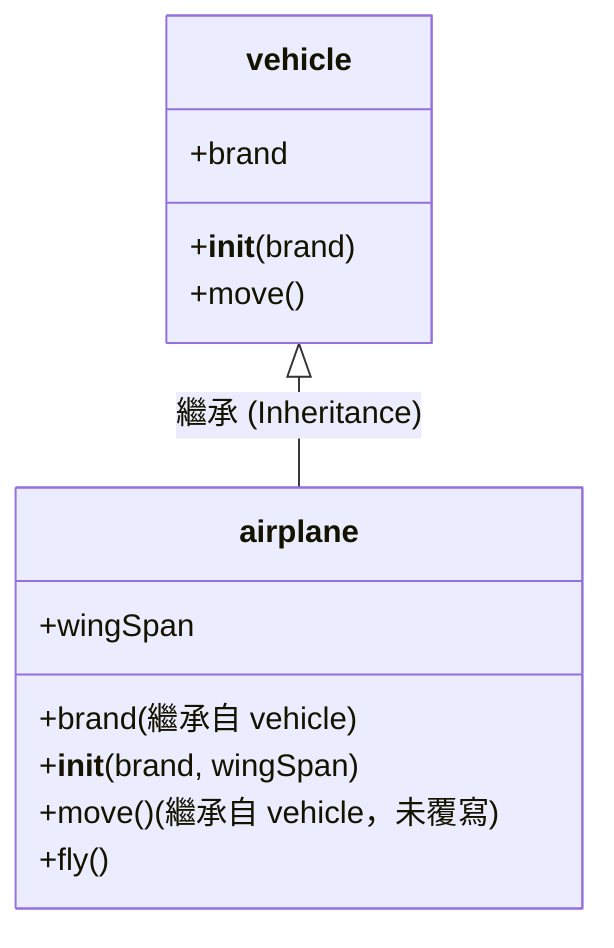
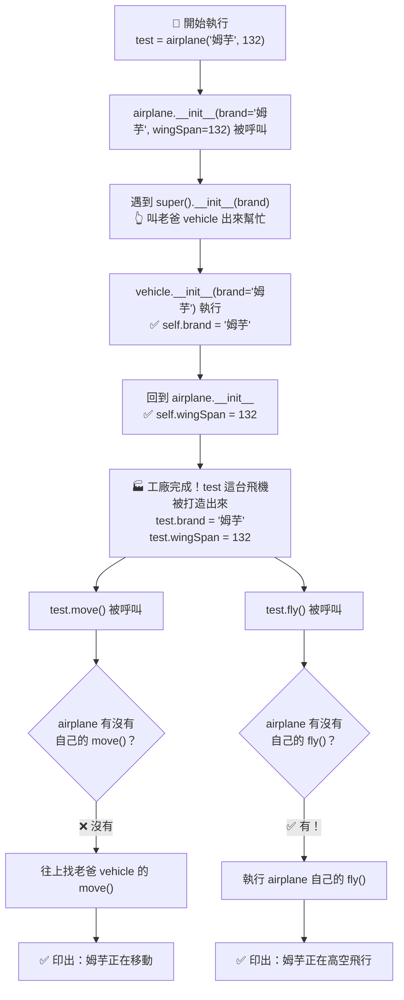
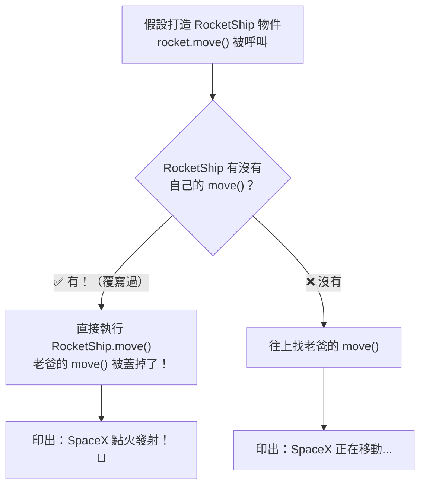
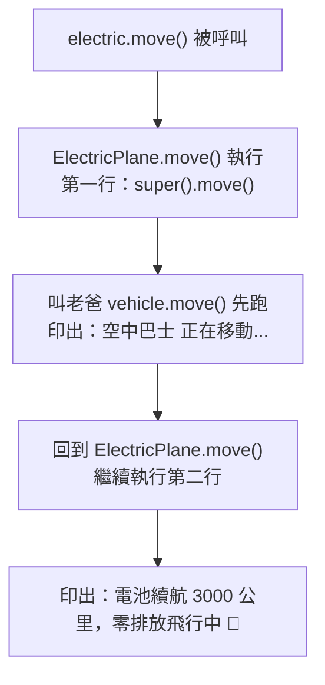

# 程式運作流程圖：繼承與 super() 說明

## 類別繼承關係圖

---

## 程式執行流程（當你執行 `test = airplane("姆芋", 132)`）

---

## 覆寫（Override）的運作邏輯

---

## super() 的加料覆寫（ElectricPlane 示範）

> **總結規則**：
> - Python 呼叫方法時，**先在兒子身上找**，找到就用兒子的。
> - 找不到，才**往上爬，去老爸那裡找**。
> - `super()` 就是「手動叫老爸出來」的魔法鑰匙。
